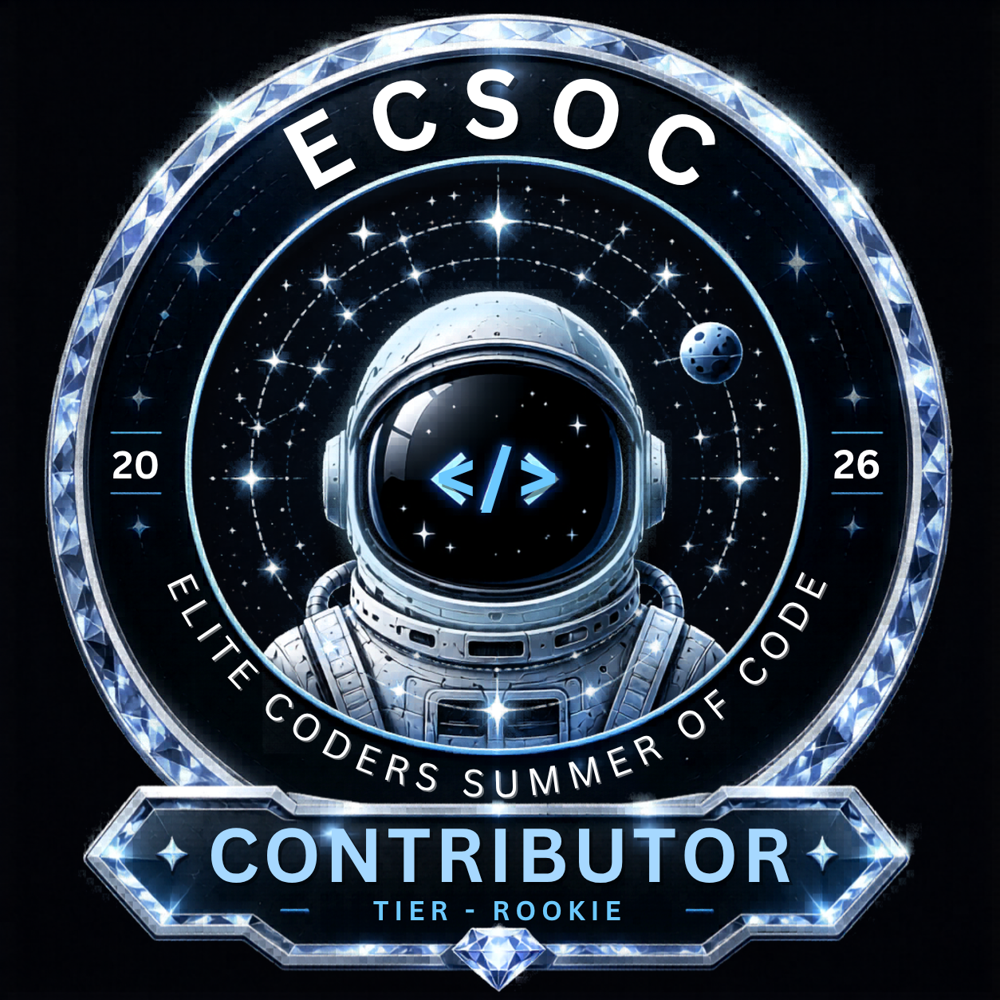
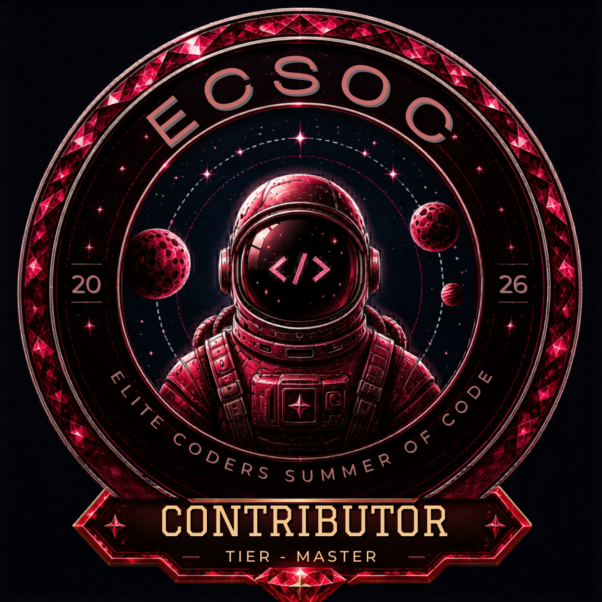

## 🚀 Backend Engineer • Java Developer • Distributed Systems Enthusiast

## 👨‍💻 About Me

- 🌱 Currently deepening my knowledge in **System Design, Distributed Systems & Backend Architecture**.
- 🐳 Working with **Docker** and containerized environments for reliable backend deployments.
- 🧠 Actively solving **Data Structures & Algorithms**, with **150+ problems solved on LeetCode**.
- ⚙️ Working with **Java, Spring Boot, REST APIs, JPA/Hibernate, SQL, Git/GitHub & Backend Engineering**.
- 👥 Led **10+ development teams**, coordinating technical execution, collaboration, and project delivery.
- 🎓 Mentored and guided **20,000+ students and developers** across technology, projects, problem-solving, and career growth.
- 🌍 Reaching approximately **100,000+ people annually** through mentorship, communities, technical work, and content.
- 🏗️ Passionate about designing **distributed, secure, scalable, and production-ready backend systems**.
- 🚀 Open to **Software Engineering, Backend Engineering & Distributed Systems Internship opportunities**.

### ⚡ Engineering Philosophy

> **Building distributed, secure backend systems engineered for real-world reliability, scalability, and impact.**

  

---
## 🏆 ECSoC 2026 — Winner

Proud to be a **Winner of ECSoC 2026 — Elite Coders Summer of Code** 🚀

An incredible journey of open-source contributions, collaboration, learning, and building. 
Grateful for every challenge, contribution, and milestone along the way. 💙

### 🚀 Contributor Progression

  
  
  
  
  

  

### 🎖️ Mission Accepted

---

### 🏆 Achievements

- 🥇 1st Place, Techfrontier 2k25, IIIT Delhi 
- 🥇 1st Place, Hackastra 2k25, NIT Durgapur
- 🥇 1st Place, Mukand Utsav 2K26
- 🥇 1st Place, Ideation 2K26
- 🚀 Finalist, ByteVerse Hackathon
- 🚀 E-Summit'25 IIT Rookie
- 🎓 Campus Ambassador, IIT Mandi (Incubator Centre)

---

# 💻 Tech Stack & Skills

### 🎯 Primary Focus Areas

- Backend Engineering
- Java & Spring Boot Development
- REST API Development
- Authentication & Authorization (JWT, OAuth2, RBAC)
- Redis Caching & Rate Limiting
- Distributed Systems Design
- Database Engineering (PostgreSQL, MySQL)
- Docker & Containerization
- Data Structures & Algorithms

---

---

### 💡 What I Build

- Distributed & Multi-Tenant Backend Systems
- Secure Authentication & Authorization Systems (JWT, OAuth2, RBAC)
- Payment-Integrated Backend Systems (Cashfree)
- RESTful APIs with Full API Documentation (Swagger/OpenAPI)
- Load-Tested, Production-Ready Backends

---

### 🔍 Keywords

`Java Developer` • `Backend Engineer` • `Spring Boot Developer` • `REST API Developer` • `System Design` • `Distributed Systems` • `Multi-Tenancy` • `Docker` • `Redis` • `PostgreSQL` • `MySQL` • `Authentication` • `JWT` • `OAuth2` • `RBAC` • `Rate Limiting` • `Backend Development` • `API Development` • `Linux` • `Data Structures` • `Algorithms` • `Open Source` • `Competitive Programming`

---

## 🌐 Connect with Me:

---

*Building backend infrastructure engineered to stay secure, scale seamlessly, and perform reliably.*
